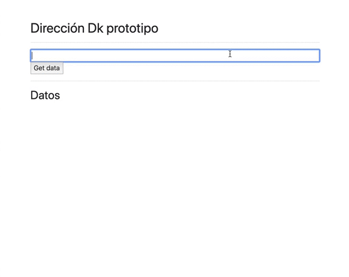

 

# TestGeolocAPI

This project was generated with [Angular CLI](https://github.com/angular/angular-cli) version 9.0.7.

Use Geolocation API from Google Maps (https://developers.google.com/maps/documentation/geocoding/start?hl=es&utm_source=google&utm_medium=cpc&utm_campaign=FY18-Q2-global-demandgen-paidsearchonnetworkhouseads-cs-maps_contactsal_saf&utm_content=text-ad-none-none-DEV_c-CRE_426163575021-ADGP_Hybrid+%7C+AW+SEM+%7C+SKWS+~+Places+%7C+BMM+%7C+Geolocation+API-KWID_43700051585719860-aud-559916008220:kwd-533802573766-userloc_9061040&utm_term=KW_%2Bapi%20%2Bgeolocation-ST_%2Bapi+%2Bgeolocation&gclid=Cj0KCQjwnv71BRCOARIsAIkxW9F5zogPTSJSp2Fm6rzmJqQ39V125bnanb99n7BIhGsLdpF4pLszfV8aAr0kEALw_wcB).

## Development server

Run `ng serve` for a dev server. Navigate to `http://localhost:4200/`. The app will automatically reload if you change any of the source files.

## Code scaffolding

Run `ng generate component component-name` to generate a new component. You can also use `ng generate directive|pipe|service|class|guard|interface|enum|module`.

## Build

Run `ng build` to build the project. The build artifacts will be stored in the `dist/` directory. Use the `--prod` flag for a production build.

## Running unit tests

Run `ng test` to execute the unit tests via [Karma](https://karma-runner.github.io).

## Running end-to-end tests

Run `ng e2e` to execute the end-to-end tests via [Protractor](http://www.protractortest.org/).

## Further help

To get more help on the Angular CLI use `ng help` or go check out the [Angular CLI README](https://github.com/angular/angular-cli/blob/master/README.md).
